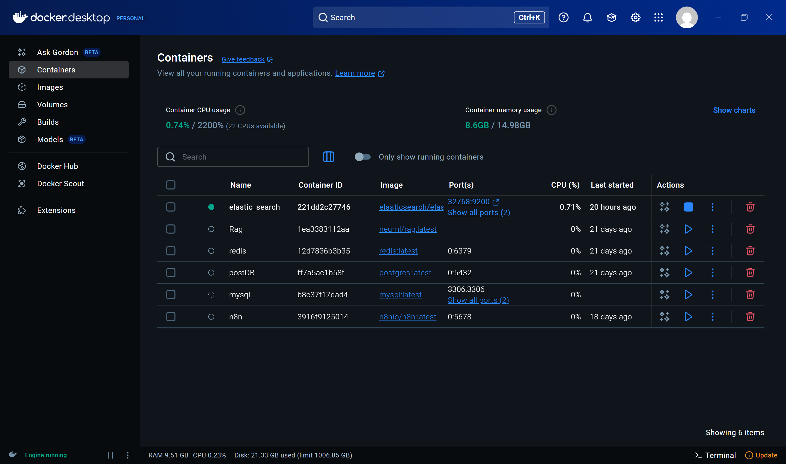

# Elasticsearch Auto-Suggestions API with React UI

A full-stack application that provides auto-suggestions and search functionality using Elasticsearch, FastAPI, and React. This project demonstrates how to build a scalable search solution with a modern web interface.

## 🎥 Application Flow

Here's a visual walkthrough of the application flow:

### 1. Docker Container with Elasticsearch Running

*Figure 1: Elasticsearch running in a Docker container*

### 2. Elasticsearch Service Running

*Figure 2: Elasticsearch service up and running*

### 3. Clothing Prompts in Elasticsearch

*Figure 3: Sample clothing prompts indexed in Elasticsearch*

### 4. Frontend UI

*Figure 4: Clean and responsive React frontend interface*

### 5. Auto-Suggestions in Action

*Figure 5: Real-time search suggestions as you type*

### 6. Suggestion Selection

*Figure 6: Selecting a suggestion from the dropdown*

### 7. Search Results

*Figure 7: Final search results with matched content and highlights*

## Features

- 🚀 FastAPI backend with Elasticsearch integration
- ⚡ Real-time search suggestions
- 🔍 Full-text search with highlighting
- 📱 Responsive React UI with TypeScript
- 🐳 Docker support for easy deployment
- 🛠️ RESTful API endpoints for search and autocomplete

## Prerequisites

- Docker and Docker Compose
- Node.js (v16 or later)
- Python 3.8+
- Elasticsearch (included in Docker setup)

## Quick Start

1. **Clone the repository**
   ```bash
   git clone https://github.com/yourusername/elastic-search-hints-api.git
   cd elastic-search-hints-api
   ```

2. **Set up the environment**
   ```bash
   # Copy the example environment file
   cp .env.example .env
   ```

3. **Start the services using Docker**
   ```bash
   docker-compose up -d
   ```
   This will start:
   - Elasticsearch (port 9200)
   - FastAPI backend (port 8000)
   - React frontend (port 3000)

4. **Access the application**
   - Frontend: http://localhost:3000
   - Backend API: http://localhost:8000
   - Elasticsearch: http://localhost:9200

## Project Structure

```
elastic-search-hints-api/
├── backend/                 # FastAPI application
│   ├── main.py             # Main FastAPI application
│   ├── requirements.txt    # Python dependencies
│   └── Dockerfile
├── frontend/               # React application
│   ├── src/
│   │   ├── components/    # React components
│   │   ├── pages/         # Page components
│   │   └── App.tsx        # Main React component
│   └── package.json
├── docker-compose.yml      # Docker Compose configuration
└── README.md              # This file
```

## API Endpoints

### Search
- `GET /search?q=query&size=10` - Search documents
- `GET /autocomplete?q=quer&size=5` - Get search suggestions
- `GET /indices` - List all Elasticsearch indices
- `GET /health` - Health check endpoint

## Development Setup

### Backend Setup

1. **Create and activate a virtual environment**
   ```bash
   python -m venv venv
   source venv/bin/activate  # On Windows: .\venv\Scripts\activate
   ```

2. **Install dependencies**
   ```bash
   pip install -r requirements.txt
   ```

3. **Run the FastAPI server**
   ```bash
   uvicorn main:app --reload --host 0.0.0.0 --port 8000
   ```

### Frontend Setup

1. **Install dependencies**
   ```bash
   cd frontend
   npm install
   ```

2. **Start the development server**
   ```bash
   npm run dev
   ```

## Environment Variables

Create a `.env` file in the root directory with the following variables:

```env
# Backend
ELASTICSEARCH_HOST=localhost
ELASTICSEARCH_PORT=9200

# Frontend
VITE_API_URL=http://localhost:8000
```

## Indexing Data

To index sample data into Elasticsearch:

```bash
# Example using curl to index a document
curl -X POST "http://localhost:8000/index" \
  -H "Content-Type: application/json" \
  -d '{"prompt": "blue jeans for men", "query": "men's blue denim jeans"}'
```

## Contributing

1. Fork the repository
2. Create your feature branch (`git checkout -b feature/AmazingFeature`)
3. Commit your changes (`git commit -m 'Add some AmazingFeature'`)
4. Push to the branch (`git push origin feature/AmazingFeature`)
5. Open a Pull Request

## License

This project is licensed under the MIT License - see the [LICENSE](LICENSE) file for details.

## Author

👤 **Yogesh Joga**

- GitHub: [@yogeshjoga](https://github.com/yogeshjoga)
- LinkedIn: [Yogesh Joga](https://linkedin.com/in/yogeshjoga)

## Acknowledgments

- [Elasticsearch](https://www.elastic.co/)
- [FastAPI](https://fastapi.tiangolo.com/)
- [React](https://reactjs.org/)
- [TypeScript](https://www.typescriptlang.org/)

---

Made with ❤️ by Yogesh Joga